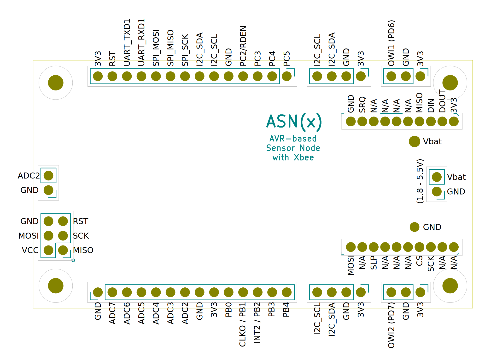
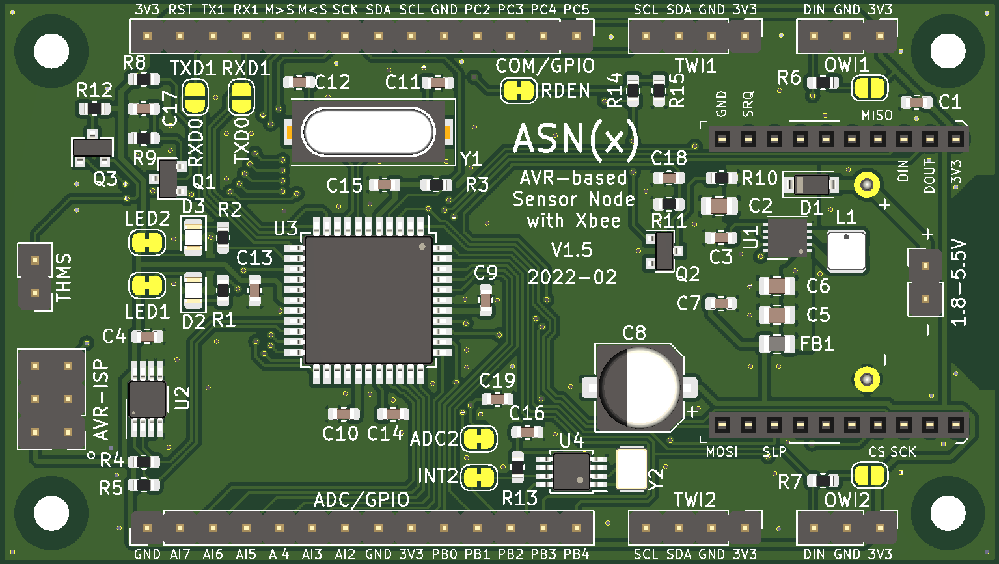

# ASN(x) - PCB Design

The board was designed with KiCad `version 5.1.9` and mainly uses schematic symbols and PCB footprints available in the [KiCad libraries](https://kicad.org/libraries/download/).
Parts not included in these libraries are available as project-specific libraries (see below).
The design requires only a two-layer PCB with all components placed on the top side.
Also, it has enough ground zone area to avoid heating or EMI issues.


## Contents

```
kicad/
├── avr_sensor_node.kicad_pcb       : PCB layout file
├── avr_sensor_node.ods             : BOM (created with LibreOffice Calc version 7.1.1.2)
├── avr_sensor_node.pro             : KiCad project file
├── avr_sensor_node.sch             : schematic layout file
├── fp-lib-table                    : project-specific footprint library list
├── mycomponents.dcm                : custom schematic library (descriptions, aliases and keywords)
├── mycomponents.lib                : custom schematic library
├── myfootprint.pretty              : custom PCB footprints
│   ├── BatteryHolder_Keystone_2462_2xAA-modified.kicad_mod
│   ├── L_Coilcraft_LPS3015.kicad_mod
│   └── XBEE-20_THT.kicad_mod
└── sym-lib-table                   : project-specific symbol library list
```


## Costs

The cost of one *ASN(x)* is around 20€ for the components (2021-05; [Farnell](https://www.farnell.com/)) and around 10€ for the PCB ([PCB Pool / Beta Layout](https://eu.beta-layout.com/pcb/)).
Thus, the total costs of one *ASN(x)* are around **30€**.
Depending on the supplier and quantities ordered, the costs may vary.


## Schematic

**Main schematic**:  


## Header Pinout
 



## PCB Design

Front:  


Back:  


For the PCB design the following rules were used:
* Design rules:
    * Minimum track width: `0.15 mm`
    * Minimum via diameter: `0.6 mm`
    * Minimum via drill: `0.3 mm`
    * Minimum hole to hole: `0.25 mm`
    * `Prohibit overlapping courtyards`
* Tracks:
    * `0.2 mm`
    * `0.25 mm`
    * `0.4 mm`
    * `0.8 mm`
* Vias:
    * Size: `0.6 mm`
    * Drill: `0.3 mm`
* Zones:
    * Clearance: `0.3 mm`
    * Minimum width: `0.18 mm`
    * Pad connections: `Thermal reliefs`
    * Thermal clearance: `0.18 mm`
    * Thermal spoke width: `0.8 mm`


## Components and Libraries

An interactive BOM can be found in the `/kicad/bom/` directory (see [here](../kicad/bom/avr_sensor_node.html); created with [InteractiveHtmlBom](https://github.com/openscopeproject/InteractiveHtmlBom)).

| Reference | Value | Symbol Library | Symbol | Footprint Library | Footprint | Dist. |
|-----------|-------|----------------|--------|-------------------|-----------|---------|
| C7-C8     | 18pF  | Device         | C      | Capacitor_SMD     | C_0603_1608Metric | [Farnell](https://at.farnell.com/kemet/c0603c180k5ractu/kondensator-18pf-50v-10-x7r-0603/dp/2821151) |
| C9        | 220pF | Device         | C      | Capacitor_SMD     | C_0603_1608Metric | [Farnell](https://at.farnell.com/wurth-elektronik/885012206055/kondensator-220pf-25v-10-x7r-0603/dp/2812352) |
| C5        | 10nF  | Device         | C      | Capacitor_SMD     | C_0603_1608Metric | [Farnell](https://at.farnell.com/kemet/c0603c103m5ractu/kondensator-0-01-f-50v-20-x7r/dp/2581043) |
| C1-C3,C6,C10-C12,C16  | 100nF | Device | C      | Capacitor_SMD     | C_0603_1608Metric | [Farnell](https://at.farnell.com/kemet/c0603c104m5ractu/kondensator-0-1-f-50v-20-x7r-0603/dp/2581046) |
| C13-C15,C17-C18   | 10uF  | Device         | C      | Capacitor_SMD     | C_0805_2012Metric | [Farnell](https://at.farnell.com/kemet/c0805c106m8racauto/kondensator-10-f-10v-20-x7r-0805/dp/2776883) |
| C4        | 100uF | Device         | C      | Capacitor_SMD     | CP_Elec_6.3x7.7   | [Farnell](https://at.farnell.com/panasonic/eeefk1e101xp/kondensator-100-f-25v-radial-smd/dp/1850109) |
| L1        | 1.5uH | Device         | L      | *myfootprint*`*`  | L_Coilcraft_LPS3015 | [Farnell](https://at.farnell.com/coilcraft/lps3015-152mrb/induktivit-t-1-5uh-20-1-3a-gesch/dp/2408018?st=1.5) |
| FB1       | -     | Device   | Ferrite_Bead | Inductor_SMD      | L_0805_2012Metric | [Farnell](https://at.farnell.com/laird/mi0805k400r-10/ferritperle-2012-100mhz-40r/dp/2292459) |
| R9-R10    | 560ohm | Device        | R      | Resistor_SMD      | R_0603_1608Metric | [Farnell](https://at.farnell.com/yageo/ac0603fr-07560rl/dickschichtwiderstand-560r-1-0/dp/3495281) |
| R1,R4-R8,R11,R16 | 10k | Device        | R      | Resistor_SMD      | R_0603_1608Metric | [Farnell](https://at.farnell.com/yageo/ac0603fr-0710kl/dickschichtwiderstand-10k-1-0/dp/3495224) |
| R2-R3,R14-R15 | 1M  | Device         | R      | Resistor_SMD      | R_0603_1608Metric | [Farnell](https://at.farnell.com/yageo/ac0603fr-071ml/dickschichtwiderstand-1m-1-0-1w/dp/3495239) |
| D1-D2     | green | Device         | LED    | LED_SMD           | LED_0805_2012Metric | [Farnell](https://at.farnell.com/kingbright/kp-2012lsgc/led-gr-n-0-8mcd-568nm-smd/dp/2463991) |
| D3        | schottky | Device  | D_Schottky | Diode_SMD         | D_SOD-123         | [Farnell](https://at.farnell.com/stmicroelectronics/stps0520z/schottky-diode-2a-20v-smd/dp/1467545) |
| U1        | -     | *mycomponents*`*` | TMP275 | Package_SO | VSSOP-8_3.0x3.0mm_P0.65mm | [Farnell](https://at.farnell.com/texas-instruments/tmp275aidgkr/temperature-sensor-0-0625deg-c/dp/3009081) |
| U2        | -     | *mycomponents*`*` | ATmega1284P | Package_QFP | TQFP-44_10x10mm_P0.8mm | [Farnell](https://at.farnell.com/microchip/atmega1284p-au/mcu-8bit-avr-128k-flash-44tqfp/dp/1715480) |
| U3        | -     | *mycomponents*`*` | TPS63031 | Package_SON | VSON-10-1EP_3x3mm_P0.5mm_EP1.2x2mm_ThermalVias | [Farnell](https://at.farnell.com/texas-instruments/tps63031dskr/dc-dc-conv-buck-boost-2-4mhz-vson/dp/3122997) |
| U4        | -     | *mycomponents*`*` | PCF85263A | Package_SO | TSSOP-10_3x3mm_P0.5mm | [Farnell](https://at.farnell.com/nxp/pcf85263att1-aj/takt-ic-aec-q100-tssop-10/dp/2890043) |
| Y1        | 4MHz  | Device         | Crystal | Crystal          | Crystal_SMD_HC49-SD | [Farnell](https://at.farnell.com/txc/9c-4-000maaj-t/xtal-4-000mhz-18pf-smd-hc-49s/dp/1842332) |
| Y2        | 32.768kHz  | Device         | Crystal | Crystal          | Crystal_SMD_3215-2Pin_3.2x1.5mm | [Farnell](https://at.farnell.com/abracon/abs07-lr-32-768khz-6-1-t/quarz-32-768khz-6pf-3-2mm-x-1/dp/2849465) |
| SW1       | push  | Switch         | SW_Push | Button_Switch_SMD | SW_SPST_PTS645   | [Farnell](https://at.farnell.com/c-k-components/pts645sm43smtr92lfs/taster-spst-0-05a-12vdc-smd-4/dp/2320087) |
| J6,J9     | - | Connector_Generic | Conn_01x02 | Connector_PinHeader_2.54mm | PinHeader_1x02_P2.54mm_Vertical | [Farnell](https://at.farnell.com/wurth-elektronik/61304011121/stiftleiste-2-54mm-tht-vertikal/dp/2356175) |
| J1-J2     | - | Connector_Generic | Conn_01x03 | Connector_PinHeader_2.54mm | PinHeader_1x03_P2.54mm_Vertical | [Farnell](https://at.farnell.com/wurth-elektronik/61304011121/stiftleiste-2-54mm-tht-vertikal/dp/2356175) |
| J4-J5     | - | Connector_Generic | Conn_01x04 | Connector_PinHeader_2.54mm | PinHeader_1x04_P2.54mm_Vertical | [Farnell](https://at.farnell.com/wurth-elektronik/61304011121/stiftleiste-2-54mm-tht-vertikal/dp/2356175) |
| J7-J8     | - | Connector_Generic | Conn_01x14 | Connector_PinHeader_2.54mm | PinHeader_1x14_P2.54mm_Vertical | [Farnell](https://at.farnell.com/wurth-elektronik/61304011121/stiftleiste-2-54mm-tht-vertikal/dp/2356175) |
| J3        | - | Connector | AVR-ISP-6 | Connector_PinHeader_2.54mm | PinHeader_2x03_P2.54mm_Vertical | [Farnell](https://at.farnell.com/wurth-elektronik/61304021121/stiftleiste-2-54mm-tht-vertikal/dp/2356148) |
| JP1       | Xbee | *mycomponents*`*` | Xbee3 | *myfootprint*`*` | XBEE-20_THT       | [Farnell](https://at.farnell.com/harwin/m22-7131042/buchsenleiste-vert-geschlossen/dp/1109732) |
| JP2-JP3,JP6-JP7 | bridged | Jumper | SolderJumper_2_Bridged | Jumper | SolderJumper-2_P1.3mm_Bridged_RoundedPad1.0x1.5mm | - |
| JP4-JP5   | open | Jumper | SolderJumper_2_Open | Jumper | SolderJumper-2_P1.3mm_Open_RoundedPad1.0x1.5mm | - |
| H1-H4     | - | Mechanical | MountingHole  | MountingHole | MountingHole_2.7mm_M2.5 | - |


If your installation of KiCad is missing (some of) the standard libraries, you can download them from [KiCad libraries](https://kicad.org/libraries/download/).
The custom libraries required (marked with `*`) are all contained in this repository.
