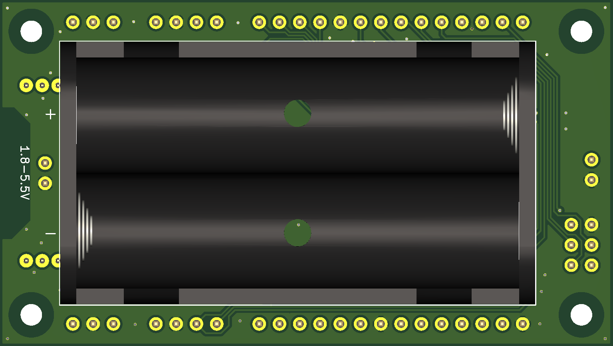

# ASN(x) - PCB Design

The board was designed with KiCad `version 5.1.9` and mainly uses schematic symbols and PCB footprints available in the [KiCad libraries](https://kicad.org/libraries/download/).
Parts not included in these libraries are available as project-specific libraries (see below).
The design requires only a two-layer PCB with all components placed on the top side.
Also, it has enough ground zone area to avoid heating or EMI issues.


## Contents

```
kicad/
├── avr_sensor_node.kicad_pcb       : PCB layout file
├── avr_sensor_node.ods             : BOM (created with LibreOffice Calc version 7.1.1.2)
├── avr_sensor_node.pro             : KiCad project file
├── avr_sensor_node.sch             : schematic layout file
├── fp-lib-table                    : project-specific footprint library list
├── mycomponents.dcm                : custom schematic library (descriptions, aliases and keywords)
├── mycomponents.lib                : custom schematic library
├── myfootprint.pretty              : custom PCB footprints
│   ├── BatteryHolder_Keystone_2462_2xAA-modified.kicad_mod
│   ├── L_Coilcraft_LPS3015.kicad_mod
│   └── XBEE-20_THT.kicad_mod
└── sym-lib-table                   : project-specific symbol library list
```


## Costs

For the bill of materials (BOM) provided in the `.ods` file links to suitable components available at [Farnell](https://www.farnell.com/) are given including the prices valid at the time of the development (2021-03).
The cost of one *ASN(x)* was around 20€ for the components ([Farnell](https://www.farnell.com/)) and around 10€ for the PCB ([PCB Pool / Beta Layout](https://eu.beta-layout.com/pcb/)).
Thus, the total costs of one *ASN(x)* are around **30€**.
Depending on the supplier and quantities ordered, the costs may vary.


## Schematic

**Main schematic**:  


## PCB Design

Front:  


Back:  


For the PCB design the following rules were used:
* Design rules:
    * Minimum track width: `0.15 mm`
    * Minimum via diameter: `0.6 mm`
    * Minimum via drill: `0.3 mm`
    * Minimum hole to hole: `0.25 mm`
    * `Prohibit overlapping courtyards`
* Tracks:
    * `0.2 mm`
    * `0.25 mm`
    * `0.4 mm`
    * `0.8 mm`
* Vias:
    * Size: `0.6 mm`
    * Drill: `0.3 mm`
* Zones:
    * Clearance: `0.3 mm`
    * Minimum width: `0.18 mm`
    * Pad connections: `Thermal reliefs`
    * Thermal clearance: `0.18 mm`
    * Thermal spoke width: `0.8 mm`


## Components and Libraries

An interactive BOM can be found in the `/kicad/bom/` directory (see [here](../kicad/bom/avr_sensor_node.html); created with [InteractiveHtmlBom](https://github.com/openscopeproject/InteractiveHtmlBom)).


| Reference | Value | Symbol Library | Symbol | Footprint Library | Footprint |
|-----------|-------|----------------|--------|-------------------|-----------|
| C7-C8     | 18pF  | Device         | C      | Capacitor_SMD     | C_0603_1608Metric |
| C9        | 220pF | Device         | C      | Capacitor_SMD     | C_0603_1608Metric |
| C5        | 10nF  | Device         | C      | Capacitor_SMD     | C_0603_1608Metric |
| C1-C3,C6,C10-C12  | 100nF | Device | C      | Capacitor_SMD     | C_0603_1608Metric |
| C13-C15   | 10uF  | Device         | C      | Capacitor_SMD     | C_0805_2012Metric |
| C4        | 100uF | Device         | C      | Capacitor_SMD     | CP_Elec_6.3x7.7   |
| L1        | 1.5uH | Device         | L      | *myfootprint*`*`  | L_Coilcraft_LPS3015 |
| FB1       | -     | Device   | Ferrite_Bead | Inductor_SMD      | L_0805_2012Metric |
| R9-R10    | 560ohm | Device        | R      | Resistor_SMD      | R_0603_1608Metric |
| R1,R4-R8,R11 | 10k | Device        | R      | Resistor_SMD      | R_0603_1608Metric |
| R2-R3     | 100k  | Device         | R      | Resistor_SMD      | R_0603_1608Metric |
| D1-D2     | green | Device         | LED    | LED_SMD           | LED_0805_2012Metric |
| D3        | schottky | Device  | D_Schottky | Diode_SMD         | D_SOD-123         |
| U1        | -     | *mycomponents*`*` | TMP275 | Package_SO | VSSOP-8_3.0x3.0mm_P0.65mm |
| U2        | -     | *mycomponents*`*` | ATmega1284P | Package_QFP | TQFP-44_10x10mm_P0.8mm |
| U3        | -     | *mycomponents*`*` | TPS63031 | Package_SON | VSON-10-1EP_3x3mm_P0.5mm_EP1.2x2mm_ThermalVias |
| Y1        | 4MHz  | Device         | Crystal | Crystal          | Crystal_SMD_HC49-SD |
| SW1       | push  | Switch         | SW_Push | Button_Switch_SMD | SW_SPST_PTS645   |
| J6        | - | Connector_Generic | Conn_01x02 | Connector_PinHeader_2.54mm | PinHeader_1x02_P2.54mm_Vertical |
| J1-J2     | - | Connector_Generic | Conn_01x03 | Connector_PinHeader_2.54mm | PinHeader_1x03_P2.54mm_Vertical |
| J4-J5     | - | Connector_Generic | Conn_01x04 | Connector_PinHeader_2.54mm | PinHeader_1x04_P2.54mm_Vertical |
| J7_J8     | - | Connector_Generic | Conn_01x14 | Connector_PinHeader_2.54mm | PinHeader_1x14_P2.54mm_Vertical |
| J3        | - | Connector | AVR-ISP-6 | Connector_PinHeader_2.54mm | PinHeader_2x03_P2.54mm_Vertical |
| JP1       | Xbee | *mycomponents*`*` | Xbee3 | *myfootprint*`*` | XBEE-20_THT       |
| JP2-JP3   | bridged | Jumper | SolderJumper_2_Bridged | Jumper | SolderJumper-2_P1.3mm_Bridged_RoundedPad1.0x1.5mm |
| JP4-JP5   | open | Jumper | SolderJumper_2_Open | Jumper | SolderJumper-2_P1.3mm_Open_RoundedPad1.0x1.5mm |
| H1-H4     | - | Mechanical | MountingHole  | MountingHole | MountingHole_2.7mm_M2.5 |


If your installation of KiCad is missing (some of) the standard libraries, you can download them from [KiCad libraries](https://kicad.org/libraries/download/).
The custom libraries required (marked with `*`) are all contained in this repository.
